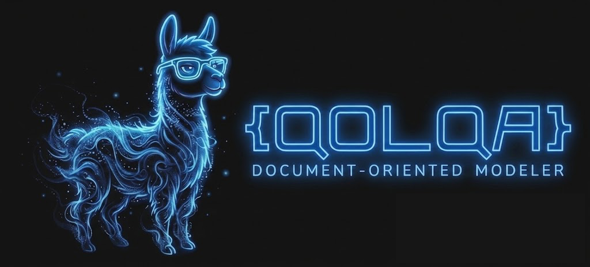
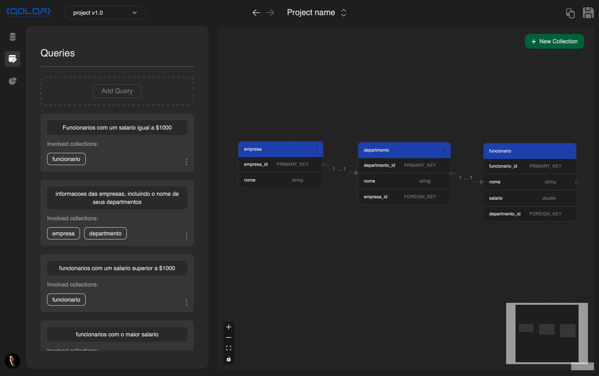
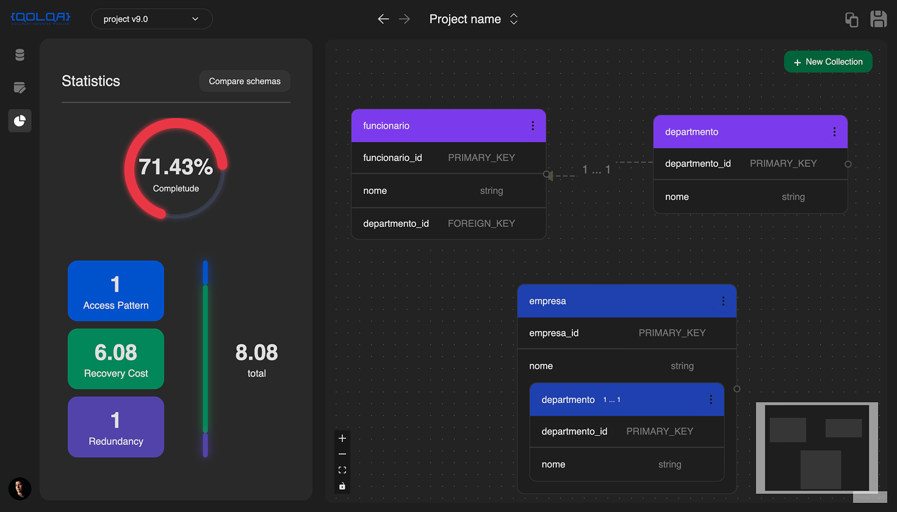
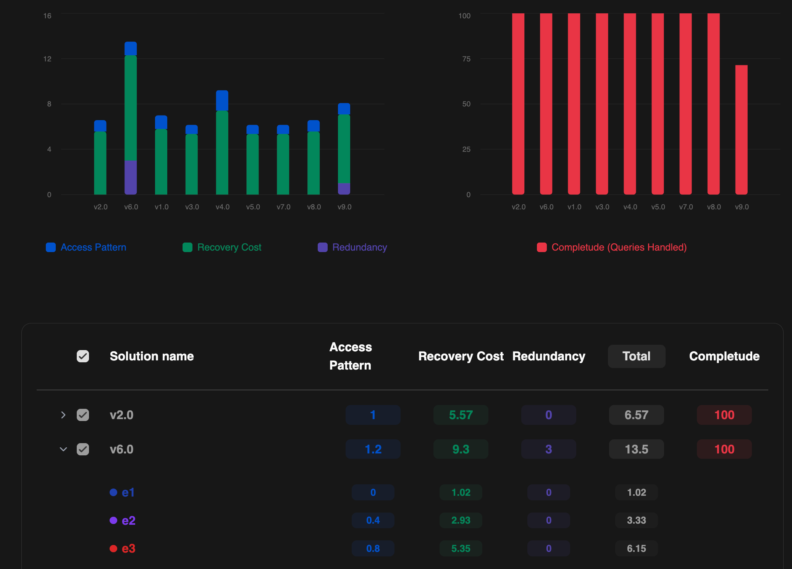

<div align="center">



# QOLQA — Document-Oriented Modeler

**A metrics-driven schema design tool for document-oriented NoSQL databases**

[](https://qolqadb.vercel.app/)
[](https://github.com/QOLQA/backend-qolqa)
[](https://github.com/QOLQA/frontend-qolqa)
[](https://youtu.be/gD1SmnvSrcI)

[Features](#-features) • [Architecture](#-architecture) • [Metrics](#-metrics-explained) • [Getting Started](#-getting-started) • [Screenshots](#-screenshots) • [Tech Stack](#-tech-stack)

</div>

---

## 📖 About the Project

**Qolqa** is a web-based schema design tool for **document-oriented NoSQL databases** that addresses critical limitations in current design solutions. While document-oriented databases are often considered "schema-less," they still require careful structural design to understand document organization, attributes, nesting levels, and relationships.

### The Problem

Current design tools present several limitations:

- **Over-reliance on expertise**: Design quality depends heavily on the designer's experience
- **Lack of evaluation metrics**: No objective criteria to assess schema quality
- **Missing query integration**: Queries are not part of the design process
- **Commercial restrictions**: Many tools are paid or have limited free versions
- **Poor multi-schema support**: Difficulty managing multiple schema versions

### Our Solution

Qolqa provides:

✅ **Evaluation metrics** to objectively measure schema quality  
✅ **Query-driven design** as a core component of the modeling process  
✅ **Multi-schema versioning** to explore and compare alternative designs  
✅ **Visual comparison** of metrics across schema versions  
✅ **Free and open-source** for academic and professional use

---

## 🎯 Features

### 1. **Interactive Design Module**

- Visual canvas for defining collections and relationships
- Support for complex nested attributes and multi-level nesting
- Reference-based and embedded relationships
- Real-time diagram updates with React Flow

### 2. **Versioning System**

- Create alternative versions from any design state
- Branch from current design without affecting the base
- Navigate through version history
- Compare multiple versions side-by-side

### 3. **Metrics Panel**

Real-time evaluation of your schema using four key metrics:

| Metric             | Description                                               |
| ------------------ | --------------------------------------------------------- |
| **Access Pattern** | Measures query efficiency and data access optimization    |
| **Recovery Cost**  | Evaluates the computational cost of reconstructing data   |
| **Redundancy**     | Detects duplicate or denormalized data across collections |
| **Completeness**   | Percentage of queries handled by the current schema       |

### 4. **Comparison View**

- Side-by-side metric visualization across versions
- Bar charts for quantitative comparison
- Tabular view with detailed breakdown
- Identify optimal solutions based on technical requirements

---

## 🏗️ Architecture

Qolqa is built on solid architectural foundations, balancing **frontend scalability** with **backend decoupling**.

### Frontend: Feature-Sliced Design (FSD)

The frontend follows **Feature-Sliced Design**, a layered architecture with strict separation of concerns:

```
app/          → Global config, routing, providers
pages/        → Route composition, data fetching
widgets/      → High-level UI blocks (Diagram canvas, Metrics panel)
features/     → Use cases (Modeling solution, Versioning, Queries, Metrics)
entities/     → Domain logic (Solution state, Metrics calculations)
shared/       → Reusable utilities, UI components, API client
```

**Key architectural decisions:**

- **React 19** with **Next.js 16** (App Router)
- **Zustand** for predictable state management
- **React Flow (XyFlow)** for interactive diagrams
- **Strict unidirectional data flow**: `shared → entities → features → widgets → pages → app`

[📚 Read the full frontend architecture docs](./docs/architecture/frontend-fsd-architecture.md)

### Backend: Clean Architecture

The backend follows **Clean Architecture** principles with strict layer isolation:

```
API Layer          → FastAPI controllers, DTOs (Pydantic validation)
Application Layer  → Use cases, orchestration
Domain Layer       → Pure entities, business logic
Infrastructure     → MongoDB repositories, JWT auth
```

**Key features:**

- **FastAPI** for high-performance REST API
- **MongoDB** for native document persistence
- **JWT-based authentication** (stateless)
- **Rate limiting** for resource protection
- **Clean separation** between domain and infrastructure

[🔗 Backend Repository](https://github.com/QOLQA/backend-qolqa)

---

## 📊 Metrics Explained

Qolqa implements four metrics based on research by **Vera-Olivera & Holanda (2024)**:

### 1. **Access Pattern (AP)**

Measures how efficiently queries can retrieve data from the schema.

- **Lower is better** → fewer collections accessed per query
- Indicates if data is properly co-located for common access patterns

### 2. **Recovery Cost (RC)**

Evaluates the computational cost of reconstructing related data.

- **Lower is better** → less overhead to join/aggregate data
- High values indicate excessive normalization or fragmented data

### 3. **Redundancy (R)**

Detects duplicated or denormalized data across collections.

- **Zero is ideal** → no redundant data
- Some redundancy may be acceptable for read-heavy workloads

### 4. **Completeness (C)**

Percentage of defined queries that can be satisfied by the schema.

- **Higher is better** → more queries handled
- 100% means all queries can be executed

---

## 🚀 Getting Started

### Prerequisites

- **Node.js** 20+ and **pnpm** (or npm/yarn)
- **Backend running** (see [backend-qolqa](https://github.com/QOLQA/backend-qolqa))

### Installation

1. **Clone the repository**

```bash
git clone https://github.com/QOLQA/frontend-qolqa.git
cd frontend-qolqa
```

1. **Install dependencies**

```bash
pnpm install
```

1. **Set up environment variables**

Create a `.env.local` file:

```bash
NEXT_PUBLIC_API_URL=http://localhost:8000
```

1. **Run the development server**

```bash
pnpm dev
```

Open [http://localhost:3000](http://localhost:3000) to see the application.

### Production Build

```bash
pnpm build
pnpm start
```

---

## 📸 Screenshots

### Modeling Canvas


_Interactive diagram canvas with collections, relationships, and nested attributes_

**Image description needed:**

- Screenshot of the main modeling canvas
- Shows multiple collections (tables) connected with relationship lines
- Example of nested attributes visible in a collection
- Sidebar with collection/attribute creation tools

### Metrics Panel


_Real-time evaluation panel showing the four key metrics_

(Image already provided)

### Comparison View


_Visual comparison of schema versions with bar charts and detailed metrics_

(Image already provided)

---

## 🛠️ Tech Stack

### Frontend

| Technology              | Purpose                         |
| ----------------------- | ------------------------------- |
| **Next.js 16**          | React framework with App Router |
| **React 19**            | UI library with React Compiler  |
| **TypeScript**          | Type-safe development           |
| **Zustand**             | Lightweight state management    |
| **React Flow (XyFlow)** | Interactive diagram rendering   |
| **Recharts**            | Metrics visualization           |
| **Tailwind CSS 4**      | Utility-first styling           |
| **Radix UI**            | Accessible component primitives |
| **Zod**                 | Schema validation               |

### Backend

| Technology   | Purpose                     |
| ------------ | --------------------------- |
| **FastAPI**  | Modern Python web framework |
| **MongoDB**  | Document-oriented database  |
| **Pydantic** | Data validation with DTOs   |
| **JWT**      | Stateless authentication    |

---

## 📚 Project Structure

```
dbcapibara-next/
├── app/                    # Next.js routes and global providers
├── src/
│   ├── app/                # App layer (global config)
│   ├── pages/              # Pages layer (route composition)
│   ├── widgets/            # Widgets layer (high-level UI blocks)
│   ├── features/           # Features layer (use cases)
│   │   ├── modeling-solution/
│   │   ├── solution-versioning/
│   │   ├── queries/
│   │   ├── modeling-metrics/
│   │   └── analysis/
│   ├── entities/           # Entities layer (domain logic)
│   │   ├── solution/
│   │   │   ├── model/      # Zustand stores
│   │   │   ├── lib/
│   │   │   │   └── metrics/  # Metrics calculation functions
│   │   │   └── types/
│   │   └── user/
│   └── shared/             # Shared layer (utilities, UI, API)
│       ├── api/
│       ├── ui/
│       └── lib/
├── docs/                   # Architecture documentation
└── public/                 # Static assets
```

---

## 🔗 Links

- **Live Demo**: [https://qolqadb.vercel.app/](https://qolqadb.vercel.app/)
- **Backend Repository**: [https://github.com/QOLQA/backend-qolqa](https://github.com/QOLQA/backend-qolqa)
- **Frontend Repository**: [https://github.com/QOLQA/frontend-qolqa](https://github.com/QOLQA/frontend-qolqa)
- **Video Demo**: [https://youtu.be/gD1SmnvSrcI](https://youtu.be/gD1SmnvSrcI)

---

## 🎓 Academic Context

This project is part of research on **NoSQL database schema design**, addressing the gap in metrics-driven design tools for document-oriented databases. The evaluation metrics are based on:

> **Vera-Olivera, H. & Holanda, M. (2024)**. _Métricas para análise de esquemas em banco de dados NoSQL orientado a documentos_. In Anais do XXXIX Simpósio Brasileiro de Bancos de Dados, pages 381–393, Porto Alegre, RS, Brasil. SBC.

---

## 📄 License

This project is open-source and available for academic and professional use.

---

## 🙏 Acknowledgments

- Research supervision and metrics design by **Vera-Olivera & Holanda**
- Built with **Feature-Sliced Design** and **Clean Architecture** principles
- UI components from **Radix UI** and **shadcn/ui**
- Diagram rendering powered by **React Flow (XyFlow)**

---

<div align="center">

**Built with ❤️ for better NoSQL database design**

[⬆ Back to top](#qolqa--document-oriented-modeler)

</div>
